# AI - HMM example
## Readings on HMMs
AIMA: Chapter 15.1-15.3

Rabiner’s famous [Tutorial on hidden Markov models and selected applications in speech recognition](http://www.cs.ubc.ca/~murphyk/Bayes/rabiner.pdf) 
and [_errata here_](http://alumni.media.mit.edu/~rahimi/rabiner/rabiner-errata/)

Thad Starner's MS thesis: Visual Recognition of American Sign Language Using Hidden Markov Models [PDF](http://dspace.mit.edu/bitstream/handle/1721.1/29089/32601581-MIT.pdf)

[The Hidden Markov Model Toolkit (HTK)](http://htk.eng.cam.ac.uk/)

Please read Chapter 1 The Fundamentals of HTK (pages 3-13) in The HTK Book (version 3.4) 
[PDF](http://speech.ee.ntu.edu.tw/homework/DSP_HW2-1/htkbook.pdf)
and [HTML](http://www.ee.columbia.edu/ln/LabROSA/doc/HTKBook21/HTKBook.html).

## Overview
Hidden Markov Models are used extensively in Artificial Intelligence, Pattern Recognition, Computer Vision, and many other computer fields.  If a system has unobservable (hidden) states and each state is independent of the prior, then we can create a model of that system using probability distributions over a sequence of observations.  The idea is that we can provide this system with a series of observations to use to query what is the most likely sequence of states that generated these observations.

### I Date
 due on December 2nd 2018 at 11:59PM UTC-12 (Anywhere on Earth).

The deliverables for the assignment are:

* All functions completed in **_hmm_submission.py_**

### The Files

You will only have to edit and submit **_hmm_submission.py_**, but here are all the notable files:
1. **_hmm_submission.py_**: Where you will construct your probabilities and viterbi trellis.
2. **_hmm_submission_tests.py_**:  Local test file.  Due to static nature of the trellis values, local tests are extremely limited.  Please do not share values or probabilities with other students if you create your own tests.

## Submission
All submissions will be via Bonnie. Enter `python submit.py` to send your submission file.  It is recommended to run this command from a shell/command prompt as issues have been known while running inside select IDEs.

#### A total of 10 submissions is allowed. We will take the LAST submission as your final submission.

Please also submit your hmm_submission.py to Canvas as backup.

### Imports
- All Standard Python modules
- Numpy

### Resources
1. Udacity Lectures on [Pattern Recognition Through Time (Lesson 8)](https://classroom.udacity.com/courses/ud954/lessons/5829639927/concepts/66950604320923)
2. Challenge Questions 22-24 on Piazza

## The Assignment
Morse Code represents each letter by a unique sequence of dots and dashes. In theory, the duration of a dash is three times the duration of a dot. Each dot or dash is followed by a short silence, equal to the dot duration. The letters of a word are separated by a space equal to three dots (one dash), and the words are separated by a space equal to seven dots. The dot duration is the basic unit of time measurement in code transmission.

The chart of Morse Code looks like:

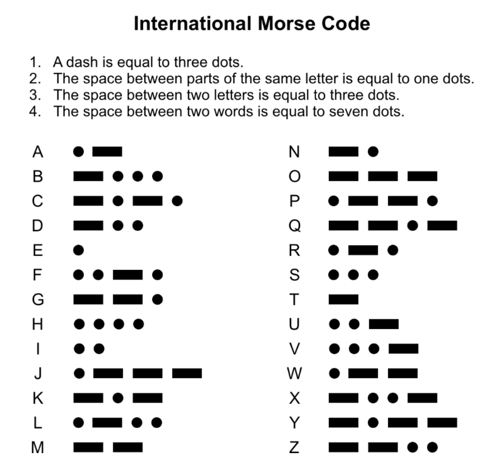

### Part 1a: Encoding the HMM
_[10 Points]_

The goal here will be take a few HMMs and encode them into python.  Let's start with the Letter A as an example.

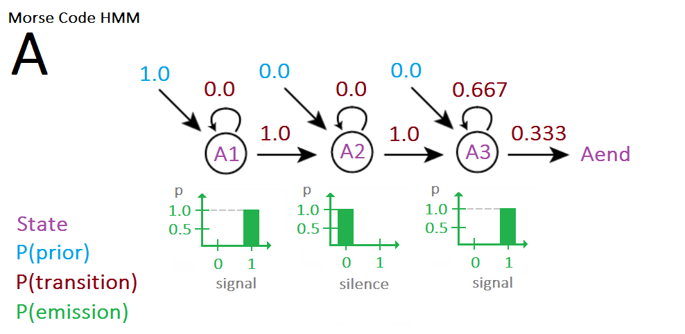

Now lets explore the components of this HMM.
* There are 4 states (A1, A2, A3, Aend) [seen in purple].
   * A1 - 1 (dot) is observed.
   * A2 - 0 (silence) is observed.
   * A3 - three 1s (dash) are observed.
   * Aend is the special state transitioned to after the HMM exits (no more letters or spaces).
* P(prior) is the probability of starting in a particular state [seen in blue].
   * In our example 'A', and for all letters, we must start with the first dot/dash state.
* P(transition) is the probability of transitioning from one state back to itself or to a new state [seen in red].
   * A dot always transitions to a silence state.
   * A dash is represented by three 1s. This is done by visiting A3 three times.  First from A2, and twice we self-transition (really stay put) to A3.
   * Silence always transitions to a dot or dash state.
* P(emission) is the probability of seeing an observation. [in green above].
   * In the case of Morse code, the output will either be a 1 (representing a dot or part of a dash) or a 0 (representing silence).

Now lets encode the above HMM into Python.

    # ['STATE1', 'STATE2', ...]

    A_states = ['A1', 'A2', 'A3', 'Aend']

    # {'STATE1': prob_of_starting_in_STATE1,
    #  'STATE2': prob_of_starting_in_STATE2, ...}

    A_prior = {'A1'  : 1.0,
               'A2'  : 0.0,
               'A3'  : 0.0,
               'Aend': 0.0}

    # {'from STATE1': {'to STATE1': prob_of_transition_from_STATE1_to_STATE1,
    #                  'to STATE2': prob_of_transition_from_STATE1_to_STATE2,
    #                  'to STATE3': prob_of_transition_from_STATE1_to_STATE3},
    # {'from STATE2': {'to STATE1': prob_of_transition_from_STATE2_to_STATE1,
    #                  'to STATE2': prob_of_transition_from_STATE2_to_STATE2,
    #                  'to STATE3': prob_of_transition_from_STATE2_to_STATE3}, ...}

    A_transition_probs = {'A1'  : {'A1'  : 0.0,
                                   'A2'  : 1.0,
                                   'A3'  : 0.0,
                                   'Aend': 0.0},
                          'A2'  : {'A1'  : 0.0,
                                   'A2'  : 0.0,
                                   'A3'  : 1.0,
                                   'Aend': 0.0},
                          'A3'  : {'A1'  : 0.0,
                                   'A2'  : 0.0,
                                   'A3'  : 0.667,
                                   'Aend': 0.333},
                          'Aend': {'A1'  : 0.0,
                                   'A2'  : 0.0,
                                   'A3'  : 0.0,
                                   'Aend': 1.0}}

    # {'STATE1': [prob_of_observing_0_in_STATE1, prob_of_observing_1_in_STATE1],
    #  'STATE2': [prob_of_observing_0_in_STATE2, prob_of_observing_1_in_STATE2], ...}

    A_emission_probs = {'A1'  : [0.0, 1.0],
                        'A2'  : [1.0, 0.0],
                        'A3'  : [0.0, 1.0],
                        'Aend': [0.0, 0.0]}

Now it's your turn.  Follow A's example, please provide the transition, prior, and emission probabilities for letters Y and Z. (accurate to 3 decimal places)

Use the following HMM probabilities:

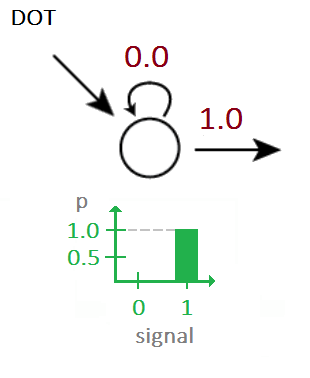
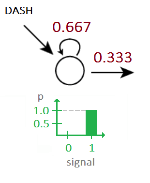
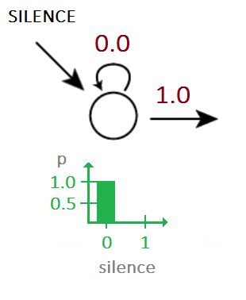

    Y_states = ['Y1', 'Y2', 'Y3', 'Y4', 'Y5', 'Y6', 'Y7', 'Yend']
    Z_states = ['Z1', 'Z2', 'Z3', 'Z4', 'Z5', 'Z6', 'Z7', 'Zend']

#### Functions to complete:
1. `part_1_a()`

---

### Part 1b: Creating the Viterbi Trellis
_[45 Points]_

The goal here will be to use a provided HMM (states, prior probabilities, transition probabilities, and emission probabilities) to build a viterbi trellis.  When provided with an evidence vector (list of observations), the function will return the most likely sequence of states that generated the evidence and the probabilty of that sequence being correct.

If no sequence can be found, the algorithm should return one of the following tuples:
`(None, 0)` (null),  `([], 0)` (empty list) or  `(['A1', 'A1', ...'A1'],0)` (Or all being the first state of that letter)

"No sequence can be found" means the probability reaches 0 midway. If you find an incomplete sequence with some probability, output that sequence with its probability. 

#### Functions to complete:
1. `viterbi()`

#### Hint:
In order to reconstruct your most-likely path after running Viterbi, you'll need to keep track of a back-pointer at each state, which directs you to that state's most-likely predecessor.

#### Bonnie Notes:
In the autograder, we will also test your code against other `evidence_vectors`.

----

### Part2a: Let's add some noise!!!
_[5 Points]_

Of course it would really easy if our state outputs were always so guaranteed with a 100% probability.  To make things a little more realistic lets add some noise to our HMM.  Now with a slight change to our emission probabilities, it's possible for a state to produce the wrong output.  To make it even more difficult, I know we are monsters, we can also have transition states that don't always behave as expected.

Revisiting our example letter 'A'

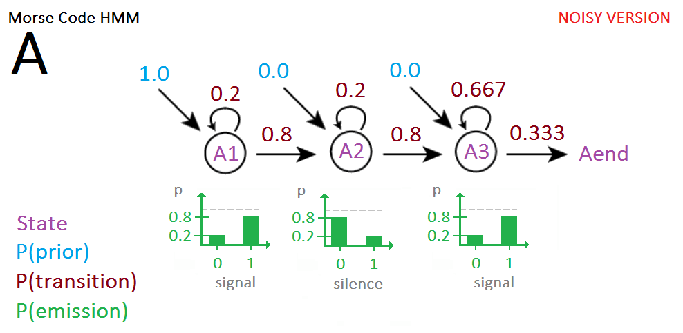

And of course the new python code:

    # ['STATE1', 'STATE2', ...]

    A_states = ['A1', 'A2', 'A3', 'Aend']

    # {'STATE1': prob_of_starting_in_STATE1,
    #  'STATE2': prob_of_starting_in_STATE2, ...}

    A_prior = {'A1'  : 1.0,
               'A2'  : 0.0,
               'A3'  : 0.0,
               'Aend': 0.0}

    # {'from STATE1': {'to STATE1': prob_of_transition_from_STATE1_to_STATE1,
    #                  'to STATE2': prob_of_transition_from_STATE1_to_STATE2,
    #                  'to STATE3': prob_of_transition_from_STATE1_to_STATE3},
    # {'from STATE2': {'to STATE1': prob_of_transition_from_STATE2_to_STATE1,
    #                  'to STATE2': prob_of_transition_from_STATE2_to_STATE2,
    #                  'to STATE3': prob_of_transition_from_STATE2_to_STATE3}, ...}

    A_transition_probs = {'A1'  : {'A1'  : 0.2,
                                   'A2'  : 0.8,
                                   'A3'  : 0.0,
                                   'Aend': 0.0},
                          'A2'  : {'A1'  : 0.0,
                                   'A2'  : 0.2,
                                   'A3'  : 0.8,
                                   'Aend': 0.0},
                          'A3'  : {'A1'  : 0.0,
                                   'A2'  : 0.0,
                                   'A3'  : 0.667,
                                   'Aend': 0.333},
                          'Aend': {'A1'  : 0.0,
                                   'A2'  : 0.0,
                                   'A3'  : 0.0,
                                   'Aend': 1.0}}

    # {'STATE1': [prob_of_observing_0_in_STATE1, prob_of_observing_1_in_STATE1],
    #  'STATE2': [prob_of_observing_0_in_STATE2, prob_of_observing_1_in_STATE2], ...}

    A_emission_probs = {'A1'  : [0.2, 0.8],
                        'A2'  : [0.8, 0.2],
                        'A3'  : [0.2, 0.8],
                        'Aend': [0.0, 0.0]}

For this part of the assignment, note our probabilities have changed for the HMM:

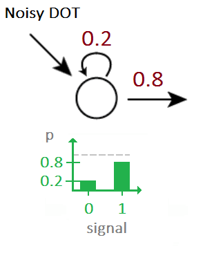
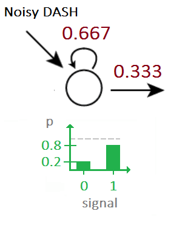
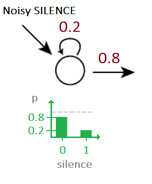

Finally we need to be able to handle more than just single letters.  We will be adding two HMMs for spaces between letters (letter pause) and words (word space).

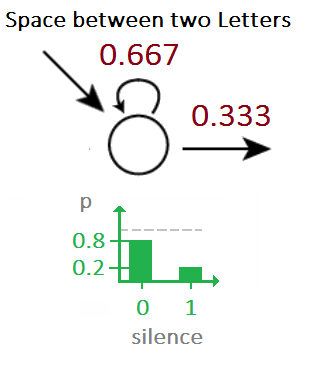
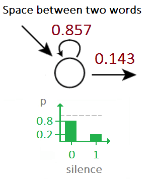

These are encoded in Python as follows:

    # ['STATE1', 'STATE2', ...]

    letter_pause_states = ['L1']
    word_space_states = ['W1']

    # {'STATE1': prob_of_starting_in_STATE1,
    #  'STATE2': prob_of_starting_in_STATE2, ...}

    letter_pause_prior = {'L1': 1.0}
    word_space_prior = {'W1': 1.0}

    # {'from STATE1': {'to STATE1': prob_of_transition_from_STATE1_to_STATE1,
    #                  'to STATE2': prob_of_transition_from_STATE1_to_STATE2,
    #                  'to STATE3': prob_of_transition_from_STATE1_to_STATE3},
    # {'from STATE2': {'to STATE1': prob_of_transition_from_STATE2_to_STATE1,
    #                  'to STATE2': prob_of_transition_from_STATE2_to_STATE2,
    #                  'to STATE3': prob_of_transition_from_STATE2_to_STATE3}, ...}

    letter_pause_transition_probs = {'L1': {'L1': 0.667,
                                            'A1': 0.333}}
    word_space_transition_probs = {'W1': {'W1': 0.857,
                                          'A1': 0.143}}

    # {'STATE1': [prob_of_observing_0_in_STATE1, prob_of_observing_1_in_STATE1],
    #  'STATE2': [prob_of_observing_0_in_STATE2, prob_of_observing_1_in_STATE2], ...}

    letter_pause_emission_probs = {'L1': [0.8, 0.2]}
    word_space_emission_probs = {'W1' : [0.8, 0.2]}

Ok let's get started!

Suppose the `evidence_vector` [1,1,1,0,1,1,1,0,1,0,0,0,1,0,0,0,1,1,1,1,1,0,1,1,1,0,1,0,0,0,0,0,1,1,1] is received. Only A, Y, Z, letter pause, and word space are involved. A sequence will start with a letter and end with a letter. The same letter may be repeated. The sequence can be made up of one or more words. And a word can be made up of one or more letters.

The beginning of the sequence can be any letter with equal probability. After each letter there is a letter pause or a word space, both with equal probability. A letter pause or word space can transition to any letter with equal probability.  When it reaches the end state, it stays at the end state.

Redefine the states, prior, transition and emission probabilities given above so that your Viterbi algorithm will be able to decode strings of letters. (With noise, accurate to 3 decimal places)

Finish the `quick_check` function and provide the probabilities for each based on the answers from `part_2a()`. Round to 3 decimal places.

#### Hints:
* The provided example for A only transitions to `Aend`....but all letters now can transition to both `letter_pause` and `word_space`.  We will need to adjust the current transition probability that goes from `A3` to now also include `Aend`, `letter_pause`, `word_space`.  Come to think of it, looking above we can see `letter_pause` or `word_space` only show transitions to letter A.  Hmm, (<-- see the pun), looks like our example above will need a few more updates...

#### Clarifications
Clarifications:
Please follow the examples when defining transition probabilities, emission probabilities and prior probabilities (use dictionary) in 1a.
 
Round the values to 3 decimal places for part 1 a and quick_check:
0.1234 rounds to 0.123
0.2345 rounds to 0.235
0.3456 rounds to 0.346
0.0123 rounds to 0.012
0.0125 rounds to 0.013
Those values can be hardcoded in your program. Don't use round() from python.
 
You are free to define 2a in any way you want as long as it works for your own 2b.
 
The answers of 1b and 2b should be within 10−3 of the correct answer. If no sequence can be found, the probability of 0 also needs to appear in the return.
"no sequence can be found" means the probability reaches 0 midway. If you find an incomplete sequence with some probability, output that sequence with the probability. 
Aend, Yend, .... don't appear in the answer for 1b. They are there because when I made the assignment, A3 has 0.333 probability transit to the next state. Aend is used to represent the next state. 
So in 2b, A can be followed by letter pause. Then L1 follows A3 instead of Aend.
 
If the observation is somehow shorter than the sequence, like it ends at A2 but with some probability, then the sequence should be output with that probability.
 
When output sequence in 2b, word space appears as a space. Letter pause appears as nothing.

For 2a, all priors should sum to one. Ignore the one in docstring

#### Functions to complete:
1. `part_2_a()`
2. `quick_check()`

---

### Part 2b: More Viterbi Trellis!
_[40 Points]_

Use your output in part 2a and the above `evidence_vector` to generate the most probable decoded letter sequence from the evidence sequence and its probability.

#### Functions to complete:
1. `part_2_b()`

#### Bonnie Notes:
In the autograder, we will also test your code against other evidence_vectors.

---

**CONGRATULATIONS!**  You have just completed your final assignment for CS6601 Artificial Intelligence.

#### Bonus
Here is a piece of code that listens for a first left mouse click and starts producing a 1 or 0 every 100 milliseconds depending on whether or not the left mouse is depressed. When it senses a “return” key, the code finishes writing the binary sequence and you can close the window. The time of pressing and depressing is rounded to the nearest 100 milliseconds.

  
    from Tkinter import *
    import sys
    import time

    message=''
    key_start=-1
    space_start=-1

    def press(event):
        global message,key_start,space_start
        times=0
        if space_start>0:
            times=int(round((time.time()-space_start)*10))
        key_start=time.time()
        for i in range(times):
            message+='0,'
            msg.insert(END,'0,')

     def depress(event):   
        global message,key_start,space_start
        times=0
        if key_start>0:	
            times=int(round((time.time()-key_start)*10))
        space_start=time.time()
        for i in range(times):
            message+='1,'
            msg.insert(END,'1,')

    def end(event):
        global message
        print message

    root=Tk()

    msg=Text(root)
    msg.pack()
    msg.config(font=('times',20))
    button=Button(root,text="press me")
    button.pack()
    button.bind('<Button-1>',press)
    button.bind('<ButtonRelease-1>',depress)
    root.bind('<Return>',end)
    mainloop()

The program provided will open a new window and the unit time is 100 milliseconds. The duration of pressing and lifting is rounded to the nearest 100 milliseconds. Use this program (and your skill as a Morse code keyer) to generate a few strings of 0s and 1s that represent words in Morse code. Please note the temporal variability of human input. For example, SOS’s morse code is ... --- ... , but the user’s input might be 11100110011100011111100111111100111111001101110011.

Finish creating HMMs for the rest of the letters of the Morse alphabet. Show that your Viterbi decoder for Morse can successfully decode the examples you made above (or at least get close). You may have to tune the transition probabilities to get reliable results. Include your binary strings and your decodings of them. Below are two webpages that you might find useful. http://code.activestate.com/recipes/578411-a-complete-morse-code-generator-in-python-with-sou/, http://www.prooffreader.com/2014/09/how-often-does-given-letter-follow.html

Besides the decoder, you also need to submit a string (only alphabets and spaces) and its morse code equivalent as performed by a human (in 0s and 1s). It should be a sentence of normal length and should be a real English sentence (comprised of real English words).

Your code will be tested against our string and strings submitted by other students. The decoder that gets the best results wins the competition. We will have no noise in the system. Temporal variability means that dots can be different lengths "1" vs. "11" vs "111" and dashes can be different lengths "11111" vs. "1111111" vs. "1111111" but the system still decodes properly. For our test sentences, we will make sure that the dots and dashes have some variability in them but still maintain that a dot is approximately 1/3 the size of the dash.

    def decoder(evidence_vector):
        #you can define your prior, emission, transition probabilities in your own format
        #sequence: like "A BC"
        return sequence
        
    def extra_credit():
        #string: like "A BC"
        #morse_code_equivalent: like [1,0,1]
        return string, morse_code_equivalent
